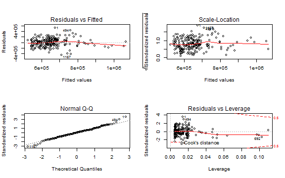

## House Price Toolbox

This presentation describes the <strong>House Price Toolbox</strong>

An application developed as part of the course assignment for Coursera Developing Data Products.

The application is available at:

http://davidan.shinyapps.io/House_Prices

Source code for ui.R and server.R files are available on the GitHub:

http://github.com/DA0155/Coursera_Developing_Data_Products

--- .class #id 

## The Application

The House Price Toolbox has two features:

1. Exploratory Data Analysis
    View different perspective of the data set.

2. House Price Prediction
    Choose your parameters and get a predicted price in AUD.

--- 

## The Data

The data was obtained from All Homes web site

http://www.allhomes.com.au

A popular real estate web site the services buyers, investors, renters, and market researcher in the Australian real estate market.

A subset of data is used for the application:
- Residential Purchases settled between 2000 to 2014
- A single suburb Hawker 2614 in the Australian Capital Territory

---

### The Model

Multivariate linear regression is used to model the Price in AUD as a function of:
- Block Size (or Lot size) in square metres
- Number of Bedrooms

 

